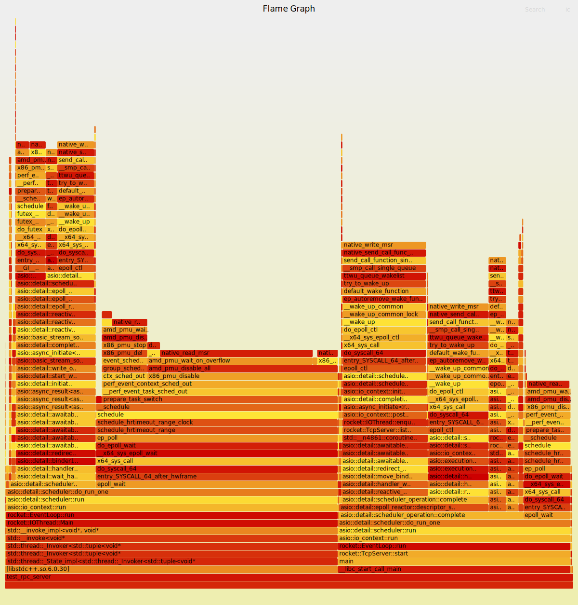

# Rocket 
  原项目 [README](./README.md.bac)
	本项目主要添加内容:
1. 本项目基于 C++20 协程，使用 asio 网络库重构项目网络模型为基于协程的网络处理模型.
（1）网络连接协程化。服务端采用一主多从的线程模型，主线程包含接受请求，分发请求到从线程进行处理。从线程对连接进行读写处理。客户端主要为对连接进行读写处理。其中处理逻辑均协程化。
（2）RPC逻辑协程化。RPC部分基于 Protobuf 提供相关类型实现，对 stub 进行封装使其支持协程调用，同时对 RPC 处理逻辑进行修改支持协程化。
（3）阅读 asio io_context 调度相关代码，理解其调度流程。

2. 实现基于 etcd 的服务注册和服务发现功能。
	(1) 基于 etcd watcher 机制实现健康检查功能。
	(2) 实现服务缓存，使用分段锁对服务缓存进行并发保护，提升并发能力。
	(3) 实现基于轮询的负载均衡。
	(4) 对 etcd 分布式原理有一定了解。

3. 实现异步日志写入模块，添加线程本地队列提升日志写入性能。
4. 使用火焰图定位服务端性能瓶颈，进行性能优化。包括将accept线程中复杂操作移至io线程处理；增加线程本地日志队列。在压测下性能提升约1倍。

## 总结
[asio-IO多路复用](./docs/asio-IO多路复用.md) \
[C++20协程实现echo服务器](./docs/C++20实现echo服务器.md)

## C++20协程学习

C++20协程文章

[Asymmetric Transfer  C++ Coroutines](https://lewissbaker.github.io/)

[My tutorial and take on C++20 coroutines](https://www.scs.stanford.edu/~dm/blog/c++-coroutines.html)

## 压测
bench存在问题，待修复

服务端火焰图如下：

